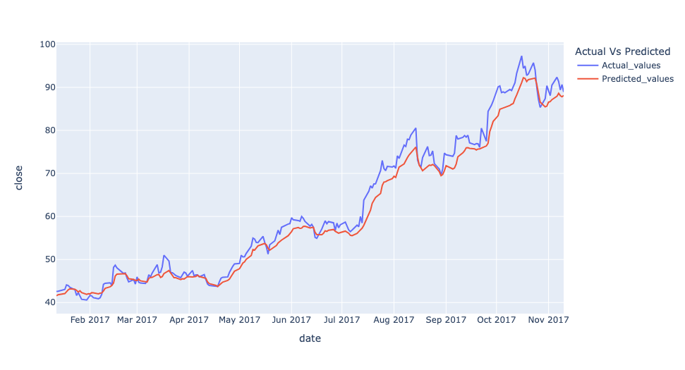
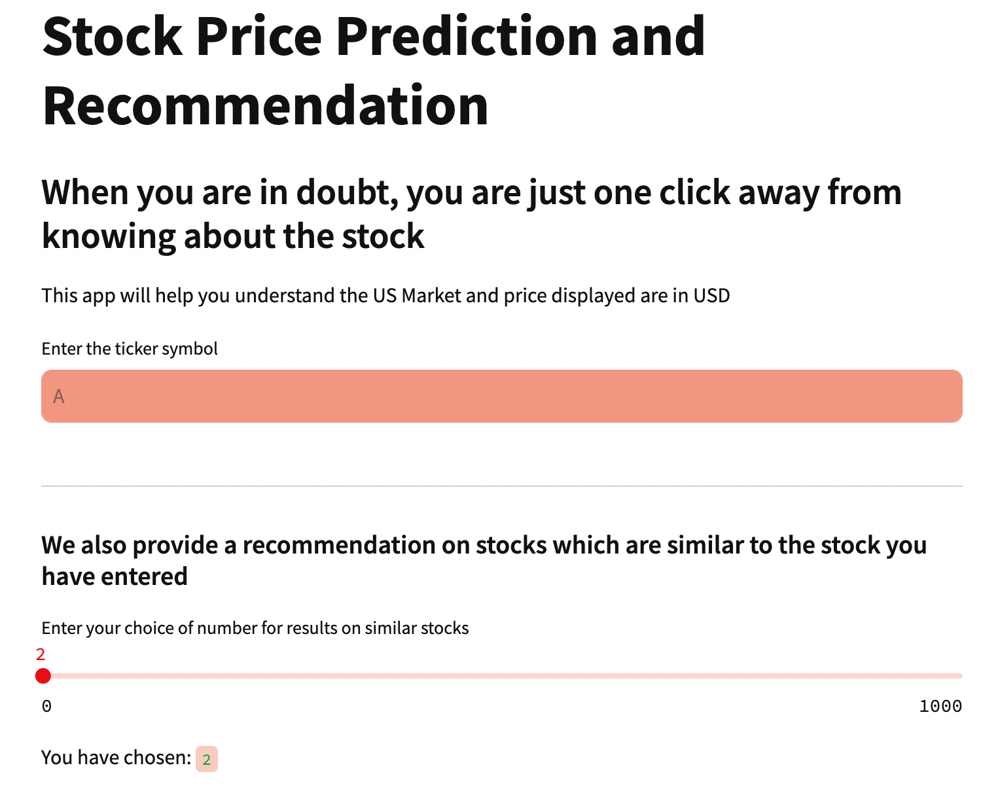
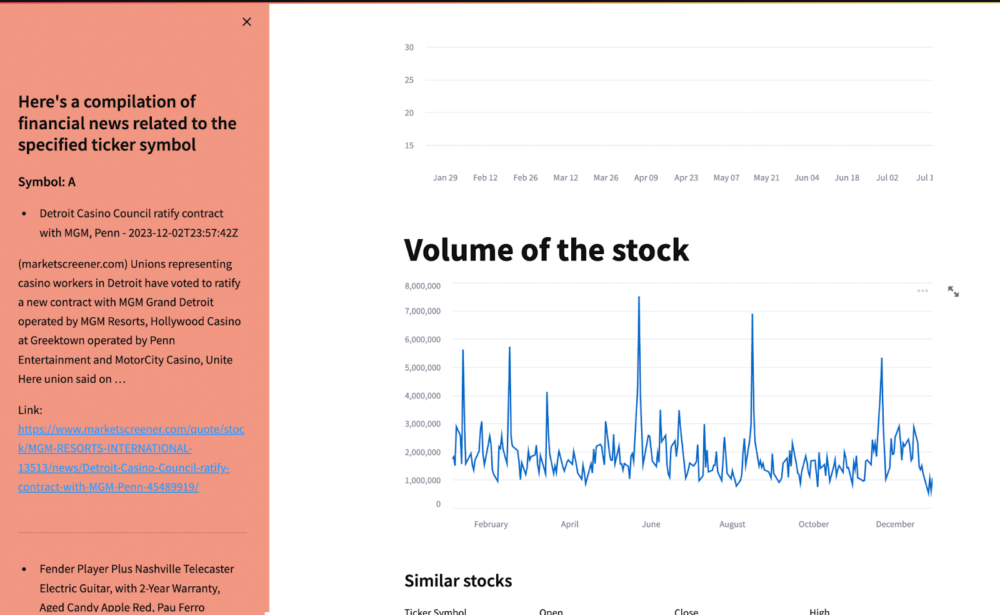

# Stock-based Recommendation System

In this project, we created an end-to-end solution for 

First, I built a clothing image classification model using a ResNet-based model. 

The feature layer of this model can .... Then, using such features, the model can recommend similar stock index to the input stock using nearest neighbor search and also predict its price in short-term.

In the final phase, the project employs an autoencoder neural network to compress multidimensional stock market data into a lower-dimensional, encoded representation. This representation is used to calculate similarities between stocks, forming the basis of a content-based recommendation system. The system aligns with content-based filtering, recommending stocks based on their similarity in encoded data features.

To enhance accessibility, the recommendation system is deployed through a web application using Streamlit. Users can input specific stocks of interest and receive tailored recommendations from the sophisticated model.

## Dataset
[Stock Market](https://www.kaggle.com/datasets/borismarjanovic/price-volume-data-for-all-us-stocks-etfs) is a large-scale clothes database that is quite popular in the research community. It contains over 800,000 diverse fashion images ranging from well-posed shop images to unconstrained consumer photos. It is annotated with rich information of clothing items. It also contains over 300,000 cross-pose/cross-domain image pairs.

[Market Index](https://www.nasdaq.com/market-activity/stocks) is 

[Financial News](https://www.kaggle.com/datasets/miguelaenlle/massive-stock-news-analysis-db-for-nlpbacktests) which we used `raw_partner_headlines.csv` to directly-scraped raw news headlines. Columns go as follows: index, headline, URL, publisher, date, stock ticker. 

More specifically, I trained the stock price prediction in the [DeepFashion Attribute Prediction](http://mmlab.ie.cuhk.edu.hk/projects/DeepFashion/AttributePrediction.html) subset. It contains 289,222 number of clothes images, 50 number of clothing categories, and 1,000 number of clothing attributes. Each image is annotated by bounding box and clothing type.

## Code
1. Phase I - EDA [acquisition-and-EDA.ipynb](acquisition-and-EDA.ipynb): This code is used to pre-process the dataset.
2. Phase II - Prediction Model & Sentiment Analysis [hyper_parameters.py](): This code is used to define all hyper-parameters regarding training.
3. Phase III - Autoencoder DL Content-based Filtering & Web App [fashion_input.py](): This code is used to pre-process the image further during training.

## Stock Price Predictor

## Streamlit App 

